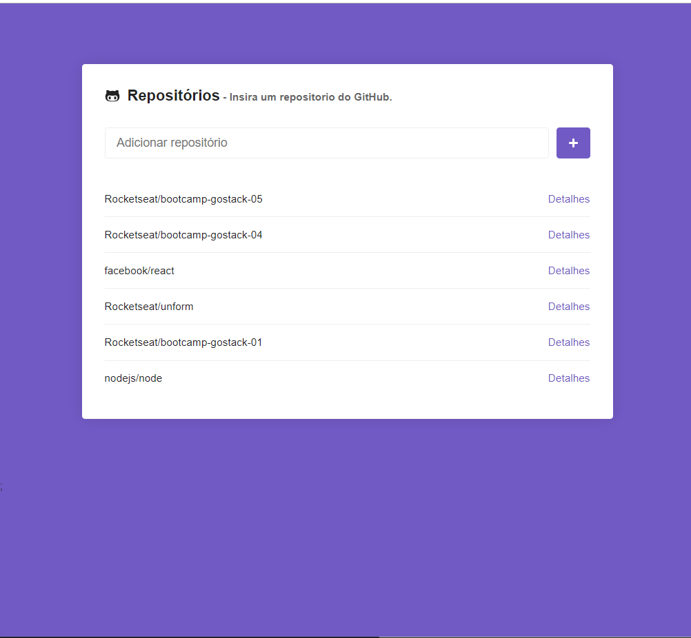
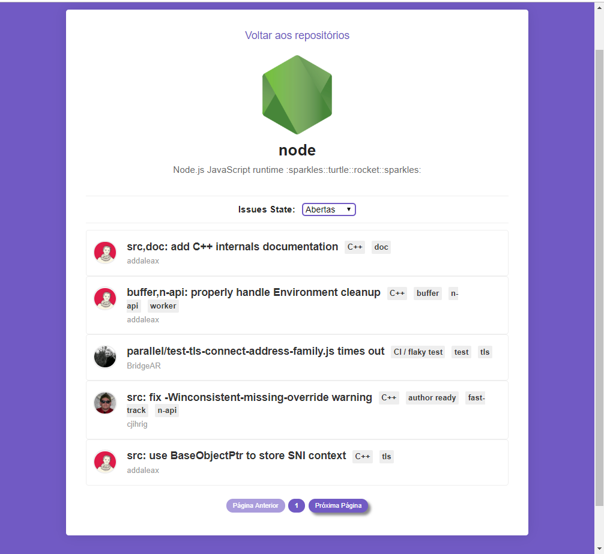

<h1 align="center" >
    
  Bootcamp 9.0 da <a text-decoration="none" href="https://rocketseat.com.br">:rocket: Rockeseat</a> - Desafio 5: Primeiro projeto com ReactJS
</h1>
<h2 align="center">
    
</h2>

<blockquote align="center">“Feito é melhor doque perfeito!"</blockquote>

  

  
  

  

  <a href="#1---sobre-o-desafio">Sobre o desafio</a>&nbsp;&nbsp;&nbsp;|&nbsp;&nbsp;&nbsp;
  <a href="#2---tecnologias">Tecnologias</a>&nbsp;&nbsp;&nbsp;|&nbsp;&nbsp;&nbsp;
  <a href="#3---funcionalidades">Funcionalidades</a>&nbsp;&nbsp;&nbsp;|&nbsp;&nbsp;&nbsp;
  <a href="#4---apresentação">Apresentação</a>&nbsp;&nbsp;&nbsp;|&nbsp;&nbsp;&nbsp;
  <a href="#5---executar-aplicação">Executar aplicação</a>

## 1 - Sobre o desafio

Nesse desafio foi incluida novas funcionalidades na aplicação que desenvolvemos ao longo do módulo 5 do Bootcamp :rocket: Rockeseat.

O projeto consiste em incluir na aplicação um repositório do GitHub e detalhar os issues do repositório. Todas as consultas do repositórios e issues são realizadas através das APIs do GitHub.

## 2 - Tecnologias

O Projeto desenvolvido em ReactJS com aplicação de diversas tecnologias e bibliotecas.

  - axios
  - prop-types
  - react-icons
  - styled-components
  - eslint
  - prettier
  - editorconfig

## 3 - Funcionalidades

  - Inclusão de repositórios do GitHub através da consulta da API re repositório.
  - Gravação dos repositórios no Local Storage.
  - Listagem dos repositórios incluidos.
  - Tratamento de exceção.
  - Detalhamento das issues dos repositórios.
  - Paginação dos issues.
  - Filtro de issues.
  - Navegação entre as rotas da aplicação.

## 4 - Apresentação

 Tela principal para inclusão e listagem dos repositórios. 

 Tela de detalhes para aprensentação e listagem das issues. 

## 5 - Executar aplicação

:heavy_check_mark: Fazer download do Projeto  
:heavy_check_mark: Abrir a pasta do projeto via linha de comando e executar o comando "yarn" para carregar as dependências do projeto.  
:heavy_check_mark: Executar o comando "yarn start" para inciar a aplicação.  

:heavy_exclamation_mark: Obs: A aplicação yarn deve estar instalada no computador.

